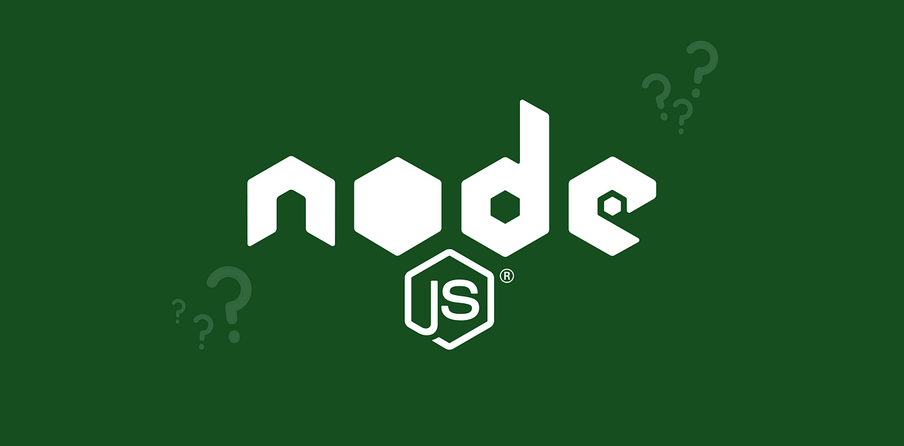

 

<strong>ExpressJS + React + Vue Project Starter</strong>

A basic ExpressJS, ReactJS, VueJS project example

 

## Features
<dl>
  <dt>Create, Read, Update, Delete</dt>
  <dd>Contain some operations like  create, read, update, and delete</dd>
  <dt>Authentication</dt>
  <dd>Content operation to handle authentication like login, register, forgot password, and reset password</dd>
  <dt>Learning Resources</dt>
  <dd>It's very friendly for beginner and can be used as a learning resources to learn ExpressJS, ReactJS, and VueJS.</dd>
</dl>

## Getting Started
- NodeJS 18 or latest
- MySQL

## Project
 - ExpressJS [Go to folder](/backend/)

This project contain some examples to build backend using REST API and how to implement it in ReactJS and VueJS.